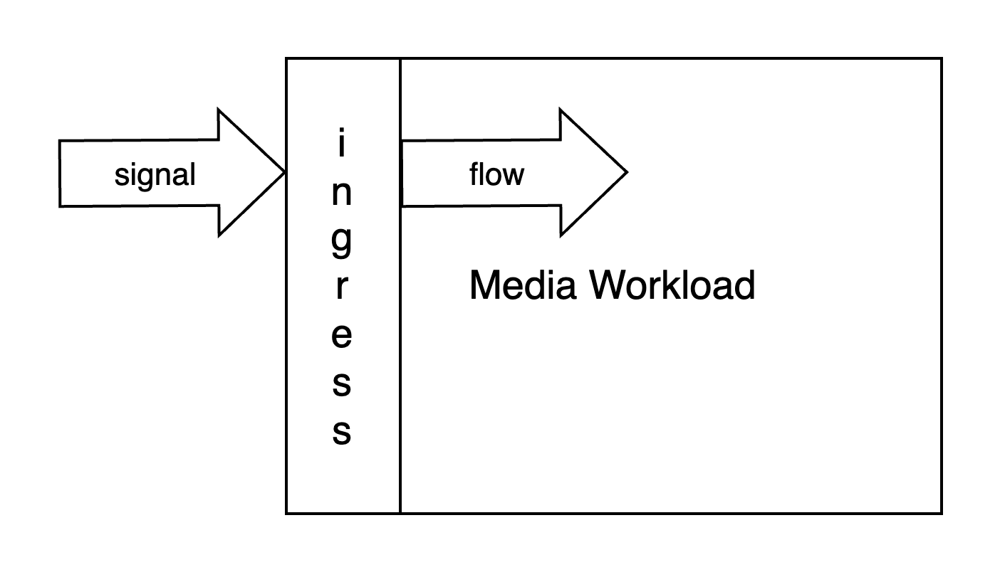
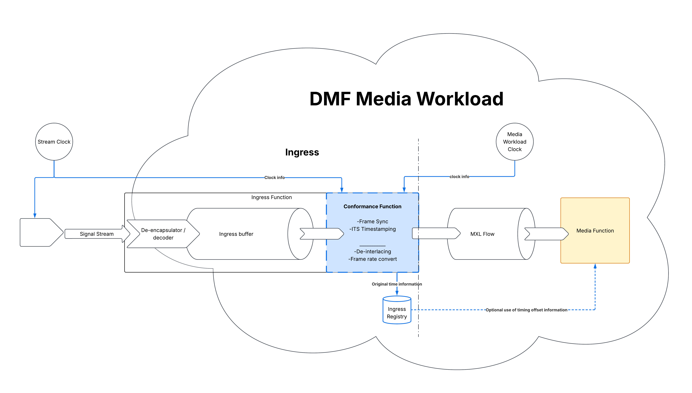

# [Timing] Principles of External Signal Ingress for DMF Media Workloads

_(c) AMWA 2026, CC Attribution-NoDerivatives 4.0 International (CC BY-ND 4.0)_

The following document summarises the principles agreed to for ingressing external Signals to a DMF Media Workload. It should be read in conjunction with the previous summary document which defines principles and terminology to which this document refers.  
Previous document reference: [https://specs.amwa.tv/in-002/Overview/](https://specs.amwa.tv/in-002/Overview/)

## Principles of External Signal Ingress for DMF Media Workloads

**Figure 1: High level external Signal ingress**

- ‘Signal’ is a generic term for any/all external media feeds that have not yet been conformed into the DMF Media Workload  
- ‘Flow’ is a term for a media feed that is usable in the DMF Media Workload  
- All external Signals entering a DMF Media Workload are conformed on ingress  
- Each Signal is ingressed for use within a Media Workload. Future work will be defining the use of ingressed flows by other local Media Workloads running locally that use a common timing domain

  
**Figure 2: Conformance Function**

- The ingress ‘Conformance’ process ensures all DMF flows can be used as ‘aligned’ within the Media Workload  
- The Conformance Function will be more or less onerous depending on the properties of the incoming Signal  
- There are two key properties of an incoming Signal that determine what processing the ingress conformance needs to do:  
  - Frequency provenance  
  - Timestamp provenance (if present)  
- An ingress registry is required to record key incoming Signal attributes  
  - Incoming Signal frequency derivation \- e.g. traceable to global timing reference  
  - Status of Incoming Signal timestamp (if present) \- usability and effective resolution  
  - Offset applied to timestamp on ingress (ns) (and potentially reason for offset)  
  - Listing of other related incoming Signals that have a timing relationship that need to be preserved  
  - Specification for this registry and how it can be queried by Media Functions is a future topic.

  
**Figure 3: Example of multi-Signal Ingress**

- As a result of the Ingress Conformance process, Flows have Indexing Time Stamps quantized to the SMPTE grid for the appropriate media type describing desired Flow timing alignment.   
- Wherever possible the ingress conformance process should avoid adding delay by buffering Signals. Desired alignment between Flows at the output of this process are expressed in terms of the relationship between the Flows’ ITS: the Conformance process manipulates these timestamps where adjustments need to be made.  
    
- The Media Workload clock is a software counter of nanosecond resolution driven from a reliable clock reference such as the facility time reference.   
- ITS offsets per Signal are a Media Workload design decision, configured to correct for anomalies and errors in alignment between Signals arriving at the Media Workload ingress boundary, as well as to ensure phase alignment of timestamps to the media unit grid.  
- An ideal Signal arriving at the DMF ingress boundary will be frequency coherent to a global time reference and will have Origin Time Stamps (OTS) phase-aligned with the SMPTE epoch for the media unit rate, propagated from the point of Signal origination. In this case Conformance is a minimal operation: the OTS for each media unit is used directly to populate the corresponding Flow ITS.  
- The Media Workload clock is used to derive ITS for Flows created from Signals without OTS.  
- Signals with OTS may be excluded from alignment according to their OTS if they have been subject to excessive upstream latency compared to other Signals, or by explicit user choice.  These Signals are treated the same way as Signals with no OTS: the ITS is taken from the Media Workload clock instead.  
- If the incoming video Signal frequency provenance is coherent to the DMF Media Workload then a virtual frame sync function is not needed as part of the video ingress function. If it is unknown or known to not be coherent, this would be required.  
- If the incoming audio Signal frequency provenance is coherent to the DMF Media Workload then a sample rate conversion function is not necessary as part of the audio ingress function. If it is unknown or known to not be coherent, this would be required.  
- Video frame sync and audio sample rate conversion functions use the Media Workload clock to form the stream of media units at the correct rate at their output, aligned to the SMPTE media unit grid. This clock is also used to derive ITS for the resulting rate-corrected Flows. 

## Future work may include

(Including those already mentioned in IN-002, repeated for convenience of a single list)

### **Flow exchange between multiple Media Workloads**

The current work started with Ingress on a Media Workload basis and this should be expanded to the exchange of Flows between local Media Workloads

### **Ingress Registry specification**

As mentioned in this document, time information for Signals that have been confirmed are recorded in a registry that needs to be specified in more detail. 

### **Egress timing**

Complimentary to this document, a focus on the egress of Flows from a Media Workload to the external linear world.

### **Upstream Signal Chain Timing**

For a fully end-to-end solution, timing relationships are better to be captured at the point of acquisition, such as the camera shutter or microphone capsule. Few protocols currently allow this information to be propagated accurately, so additional work outside JT-DMF will be required.

### **Multi-Cluster Timing**

Media exchange and timing between clusters, including maintaining asynchronous operation across WAN-connected sites, remain subjects for further study.

### **Status & metrics logging**

Documentation of modifications made through the ingress conformance process against the resulting Flow timeline. Include mechanisms to support error detection and handling, as well as traceability of original OTS from conformed Flows.

### **Timing planes for alignment**

Definitions of Signal alignment principles 
